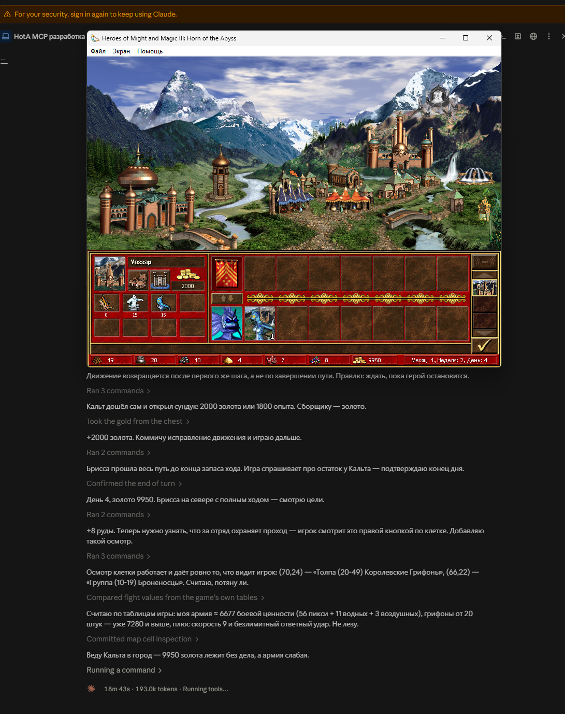

<div align="center">

# hota-mcp

**Игровой мост к Heroes III: Horn of the Abyss — ИИ-агент играет в игру теми же кнопками, что и человек.**

[](#статус)
[](LICENSE)
[](https://github.com/timoncool/hota-mcp/stargazers)
[](https://github.com/timoncool/hota-mcp/commits)



</div>

> **Незавершённый экспериментальный проект (WIP).** Репозиторий открыт, чтобы за ходом работы можно было следить, а не потому, что мост готов к употреблению. Сборки, установщика и стабильного API пока нет, интерфейс инструментов меняется от коммита к коммиту. Описание и документация — на русском, английскую версию сделаю позже.

## Что это

MCP-сервер, который подключается к **установленной у вас** Heroes III Complete + HotA + HD Mod и даёт ИИ-агенту играть в неё на общих с человеком правах: агент видит состояние партии структурой (без OCR и разглядывания скриншотов) и нажимает настоящие кнопки настоящего интерфейса.

Зачем: из этого получается честный **бенчмарк «ума» агентов**. Герои — игра с длинным горизонтом планирования, экономикой, разведкой и боями, где нельзя выиграть одним удачным ходом. Модель либо строит стратегию, либо сливает. Задуманные режимы: агент против компьютера, агент против человека, агент в паре с человеком и несколько агентов друг против друга.

Чтобы знание правил не зависело от того, что модель запомнила на обучении, в мост встроена **база знаний по игре с поиском** — справка, механики, разбор ситуаций и оценка сил. Агент может «погуглить» в ней, как человек лезет на вики: чем существа отличаются, что строить раньше, когда лезть в банк.

## Статус

| Область | Состояние |
|---|---|
| Чтение состояния партии (герои, город, ресурсы, карта, журнал) | работает |
| Главное меню, загрузка сейва, запуск сценария кнопками | работает |
| Ход по карте, сбор объектов, конец хода | работает |
| Город: вход, стройка, найм через форт, таверна, обмен героев | работает |
| Разметка экранов «по смыслу» (кнопка = что делает, а не id контрола) | в процессе, это сейчас основная работа |
| Бои | частично |
| Настройка новой партии (сложность, цвет, бонус, команды) | нет |
| Установщик и запуск ярлыком «HotA MCP» (сервис → лаунчер со вкладкой → игра) | работает |
| Автообновление, стабильный релиз | нет |

Подробная карта покрытия — [docs/CAPABILITIES.md](docs/CAPABILITIES.md), текущая точка продолжения — [docs/STATE.md](docs/STATE.md).

## Принципы

- **Никакой автоматизации за агента.** Одно действие — один вызов инструмента. Скрипты-циклы, которые сами ходят и закрывают диалоги, измеряли бы скрипт, а не модель.
- **Только штатные механизмы.** Кнопки жмутся адресным оконным событием в границах, которые сам контрол сообщает через UI-структуры. Внутренние команды экранов запрещены: они обходят интерфейс и дважды ломали партию.
- **Наружу уходит смысл, а не номер.** Существа и объекты — по именам, кнопки — по тому, что они делают, награда — «золото 1000», а не «1000».
- **Ничего чужого в репозитории.** Игровых бинарников, сейвов и ключей здесь нет: мост работает с вашей собственной легальной копией игры.

## Инструменты MCP

`observe`, `look`, `state`, `read_map`, `read_journal`, `nearby_targets`, `inspect_tile`, `inspect_target`, `inspect_element`, `move_to`, `move_to_tile`, `map_click`, `click_ui`, `attack_target`, `plan`, `mark`, `inspect_path`, `start_game`, `game_status`, `hota_docs`, `hota_reference`, `debug_snapshot`, `diagnostic`.

Навык для агента — [skills/hota-player/SKILL.md](skills/hota-player/SKILL.md).

## Требования

- Windows, ваша копия **Heroes III Complete** (GOG) + **HotA** + **HD Mod**;
- .NET для сервера и C++ x86 для нативного модуля — Python в продуктовом стеке нет;
- адаптер привязан к проверенным хешам исполняемых файлов: другая сборка требует отдельной проверки.

Готовой сборки пока нет — проект собирается из исходников.

## Установка и запуск

1. Собрать нативную вкладку лаунчера: `native\launcher\build.cmd` (Visual Studio Build Tools, x86).
2. Установить: `powershell -File tools\install.ps1`. Ставит сервис в `%LOCALAPPDATA%\Programs\HotaMcp`
   и кладёт ярлык **«HotA MCP»** на рабочий стол и в Пуск. В папке игры ничего не меняется, в
   автозагрузку Windows ничего не пишется.
3. Запуск — ярлыком «HotA MCP»: поднимается сервис, открывается ваш HD Launcher со вкладкой MCP,
   затем запускается игра. Всё закрывается вместе с лаунчером. MCP-клиент, подключённый через stdio
   (`HotaMcp.exe --stdio`), запускает ту же цепочку сам, если ничего не запущено.
4. Удалить: `powershell -File tools\uninstall.ps1`.
5. Цвет, за который играет мост в хотсите: `Player=синий` (или номер 0–7) в
   `%LOCALAPPDATA%\HotaMcp\settings.ini`. В чужой ход мост только читает свою сторону и ничего не
   нажимает. `Player=все` — мост играет за того человека, чей сейчас ход, и у каждой стороны свои
   план, метки и журнал (тест хотсита одним контроллером).
6. Сколько стоила партия: `HotaMcp.exe --usage [--game <id>]` — стоимость в долларах, запросы к
   модели, токены и вызовы моста по дням игры. Стоимость присылает сам Claude Code своей
   телеметрией (OpenTelemetry, событие `api_request` с `cost_usd`); мост принимает её на
   `http://127.0.0.1:18773/v1/logs` и засчитывает сессиям, которые вызывают мост. Включить — в
   `~/.claude/settings.json`, действует с новой сессии:
   ```json
   "env": {
     "CLAUDE_CODE_ENABLE_TELEMETRY": "1",
     "OTEL_LOGS_EXPORTER": "otlp",
     "OTEL_EXPORTER_OTLP_LOGS_PROTOCOL": "http/json",
     "OTEL_EXPORTER_OTLP_LOGS_ENDPOINT": "http://127.0.0.1:18773/v1/logs",
     "OTEL_LOG_TOOL_DETAILS": "1"
   }
   ```
   `OTEL_LOG_TOOL_DETAILS` нужен, чтобы мост видел, какая сессия играет; данные никуда, кроме
   локального моста, не уходят.

Правила для агента (запуск, одно действие за вызов, никакой мыши и computer-use) сервер отдаёт
клиенту при подключении; подробно — в [навыке](skills/hota-player/SKILL.md) и в
[начале работы](docs/knowledge/agent/00-start-here.md).

## Документация

- [ТЗ](TZ.md) — что задумано целиком
- [docs/STATE.md](docs/STATE.md) — контрольная точка и что проверено живьём
- [docs/TASKS.md](docs/TASKS.md) — список задач
- [docs/CAPABILITIES.md](docs/CAPABILITIES.md) — карта покрытия функций игры
- [docs/UI-ATLAS.md](docs/UI-ATLAS.md) — разметка экранов
- [docs/knowledge/](docs/knowledge/) — корпус знаний для агента

## Авторы

**Илья Тимонин (Nerual Dreming)** — [Telegram](https://t.me/nerual_dreming) · [GitHub](https://github.com/timoncool) · [YouTube](https://www.youtube.com/@nerual_dreming)

Heroes of Might and Magic III и Horn of the Abyss принадлежат их правообладателям. Проект независимый, фанатский, исследовательский.

## Поддержать автора

Я создаю опенсорс софт и занимаюсь исследованиями в области ИИ. Большая часть всего, что я делаю, находится в открытом доступе. Ваши пожертвования позволяют мне создавать и исследовать больше, не отвлекаясь на поиск еды для продолжения существования =)

**[Все способы поддержки](https://github.com/timoncool/ACE-Step-Studio/blob/master/DONATE.md)** | **[dalink.to/nerual_dreming](https://dalink.to/nerual_dreming)** | **[boosty.to/neuro_art](https://boosty.to/neuro_art)**

- **BTC:** `1E7dHL22RpyhJGVpcvKdbyZgksSYkYeEBC`
- **ETH (ERC20):** `0xb5db65adf478983186d4897ba92fe2c25c594a0c`
- **USDT (TRC20):** `TQST9Lp2TjK6FiVkn4fwfGUee7NmkxEE7C`

## Лицензия

[MIT](LICENSE)
