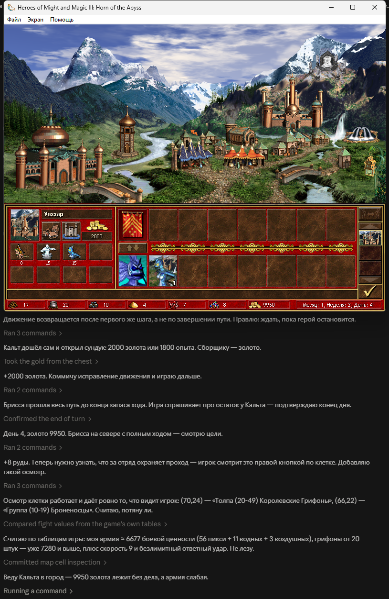
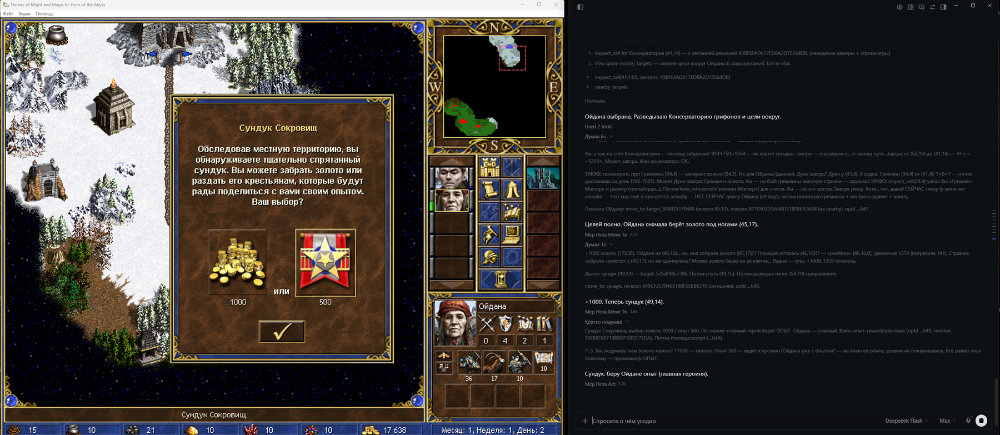
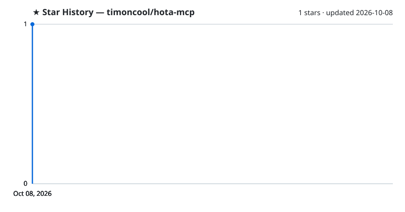

<div align="center">

# HotA MCP

**MCP-сервер, через который ИИ-агент играет в Heroes of Might and Magic III: Horn of the Abyss как живой игрок — тот же экран, те же кнопки, партия целиком от меню до победы.**

[](https://github.com/timoncool/hota-mcp/releases/latest)
[](https://github.com/timoncool/hota-mcp/releases)
[](LICENSE)
[](https://github.com/timoncool/hota-mcp/stargazers)
[](https://github.com/timoncool/hota-mcp/commits)

**[Русский](README.md)** · **[English](README_EN.md)**



</div>

HotA MCP подключает ИИ-агента (Claude, DeepSeek или любой MCP-клиент) к **установленной у вас** Heroes III Complete + HotA + HD Mod на Windows. Агент читает игру структурой — без OCR и разглядывания скриншотов — и нажимает настоящие кнопки интерфейса оконными событиями. Ставится одним установщиком, запускается одним ярлыком, дальше — «давай поиграем в героев».

Зачем: Герои — стратегия с длинным горизонтом: экономика, разведка, бои, карта, которую берут неделями. Одним удачным ходом её не выиграть, поэтому из неё выходит честный **бенчмарк стратегического мышления агентов** — в одиночку, против человека или в команде с ним.

> **Ищем тестеров и переводчиков.** Версия 1.0 проверена на русской HotA. Если вы играете в Героев на другом языке или хотите справочник и сообщения агента на своём языке — раздел [Нужна помощь](#нужна-помощь).



## Возможности

- **Играет как человек** — читает то, что на экране, и жмёт кнопки самой игры; без перехвата мыши, computer-use и внутренних команд игры.
- **Вся партия** — главное меню, настройка сценария и случайной карты, хотсит, сохранение и загрузка, карта приключений, города, найм, обмен, бои и осады, повышения, экран итогов.
- **Всё словами** — каждый `observe` начинается со сводки хода; герои, города, отряды и объекты по именам; маршруты, стоимость и отметки «посещено» — от самой игры.
- **Честные границы** — то, чего не может игрок (скрытая карта, чужой ход, устаревший взгляд), отклоняется с кодом причины, без догадок.
- **Встроенный справочник** — правила, формулы, карточки существ и артефактов из таблиц установленной игры, поиск офлайн (`hota_docs`, `hota_reference`).
- **Хотсит и команды** — мост передаёт цвет хода и участников сценария, свой цвет агент определяет сам; союзники и противники — из сценария, ходы союзника пишутся в журнал.
- **Стоимость партии** — доллары, токены и вызовы по сторонам и дням игры из телеметрии Claude Code (`HotaMcp.exe --usage`).
- **Ничего настраивать** — установщик для пользователя, без прав администратора и без установки .NET; в папку игры и автозагрузку ничего не пишется.

## Требования

- Windows 10/11 x64.
- Ваша копия **Heroes of Might and Magic III Complete** (GOG) с **Horn of the Abyss 1.8.0** и **HD Mod** — сборка сверяется по хешам файлов.
- MCP-клиент: Claude Code, Claude Desktop, Codex или любой другой с MCP через stdio или HTTP.

## Быстрый старт

1. **Установить** — скачать [`HotaMcp-Setup-1.0.0.exe`](https://github.com/timoncool/hota-mcp/releases/latest) и запустить (сначала закройте HD Launcher). Игру он найдёт сам и положит ярлык **«HotA MCP»** на рабочий стол.

2. **Подключить MCP-клиент** — для Claude Code:
   ```bash
   claude mcp add hota -- "C:\Users\<вы>\AppData\Local\Programs\HotaMcp\app\HotaMcp.exe" --stdio
   ```
   Claude Desktop (`claude_desktop_config.json`):
   ```json
   {
     "mcpServers": {
       "hota": {
         "command": "C:\\Users\\<вы>\\AppData\\Local\\Programs\\HotaMcp\\app\\HotaMcp.exe",
         "args": ["--stdio"]
       }
     }
   }
   ```
   Если ставили в другую папку — укажите её.

3. **Играть** — скажите агенту «давай поиграем в героев». Он вызовет `start_game`: поднимутся служба, ваш HD Launcher со вкладкой MCP и игра. Или запустите всё сами ярлыком «HotA MCP».

Правила (одно действие за вызов, никакой мыши, справочник вместо памяти) сервер отдаёт клиенту при подключении. Полный порядок игры для агента — навык [`skills/hota-player/SKILL.md`](skills/hota-player/SKILL.md), дайте его своему агенту.

## Использование

| Инструмент | Для чего |
|---|---|
| `observe` | Всё состояние своей стороны и действия, доступные на этом экране — вызов, без которого нельзя |
| `act` | Любое смысловое действие из `observe`: город, найм, бой, диалог, конец хода |
| `nearby_targets`, `inspect_target`, `read_map` | Что вокруг, маршрут и стоимость от самой игры, разведанная карта |
| `move_to`, `move_to_tile`, `attack_target` | Ходьба и бой — нарочно разные инструменты |
| `inspect_cell`, `inspect_element`, `inspect_tile` | Карточки правой кнопки и строка состояния, которые читает игрок |
| `wait_for_turn`, `ally_log` | Хотсит: ждать своего хода или окна, адресованного вам; что сделал союзник |
| `plan`, `mark`, `read_journal` | Память агента между ходами |
| `hota_docs`, `hota_reference` | Справочник по игре |
| `debug_snapshot` | Кадр и наблюдение одной парой — чтобы сообщить, что мост читает не так |

Каждое действие берёт `operationId` и `revision` наблюдения, по которому решено: повтор с тем же id безопасен, устаревший взгляд отклоняется. Все 31 инструмент перечисляет `hota_tools`, полные описания — [docs/knowledge/agent/01-tools.md](docs/knowledge/agent/01-tools.md).

## Настройка

Настраивать стороны не нужно, файлов настроек нет — всё берётся из самой игры.

- **Свой цвет агент определяет сам** — при создании или загрузке партии, по окну сценария: там видны все стороны, кто человек, имена и команды. Цвет он записывает в план.
- **Мост в каждом `observe` передаёт цвет интерфейса** — «Ходит синий». Чужим цветом агент не играет и ждёт своего хода `wait_for_turn` со своим цветом.
- **Цвет не привязан.** Скажете «поиграй за меня» — агент возьмёт ваш цвет, пока вы не вернётесь.
- **В ход компьютера** мост показывает того человека, кому адресовано окно на экране: бой против него, итог, трофеи, повышение, конец партии.
- **Союзники и противники — из команд сценария:** ходы союзника пишутся в `ally_log`, ходы противника — нет.

**Стоимость партии.** Добавьте в `~/.claude/settings.json` (действует с новой сессии):
```json
"env": {
  "CLAUDE_CODE_ENABLE_TELEMETRY": "1",
  "OTEL_LOGS_EXPORTER": "otlp",
  "OTEL_EXPORTER_OTLP_LOGS_PROTOCOL": "http/json",
  "OTEL_EXPORTER_OTLP_LOGS_ENDPOINT": "http://127.0.0.1:18773/v1/logs",
  "OTEL_LOG_TOOL_DETAILS": "1"
}
```
Затем `HotaMcp.exe --usage`. Данные никуда, кроме локального моста, не уходят.

**Таймауты инструментов.** Автобой идёт до 3 минут, мост ждёт его исхода: поднимите таймаут вызова инструмента в клиенте (у Codex — `tool_timeout_sec = 200` в `[mcp_servers.hota]`, по умолчанию 60).

## Нужна помощь

Мост читает игру на том языке, на котором она установлена, и проверен на **русской** HotA 1.8.0. Его сводки, навык агента и справочник — тоже на русском. Здесь и нужна помощь:

- **Играть и сообщать.** Поставьте, дайте агенту поиграть и откройте issue о том, что пошло не так. Что приложить (`debug_snapshot`, журнал, `errors.log`) — в [`CONTRIBUTING.md`](CONTRIBUTING.md).
- **Другие языки игры.** Если ваша HotA английская, польская, немецкая, китайская… — расскажите, что мост не читает. Около двух десятков фраз игры сверяются по тексту, список — в [`CONTRIBUTING.md`](CONTRIBUTING.md).
- **Переводы.** Навык агента, справочник (`docs/knowledge`), README — на ваш язык. Модели играют лучше, когда справочник говорит на языке игры, которую они видят.

## Документация

- [CHANGELOG.md](CHANGELOG.md) — что вошло в каждый выпуск
- [skills/hota-player/SKILL.md](skills/hota-player/SKILL.md) — как играет агент
- [docs/knowledge/](docs/knowledge/) — справочник, который отдаёт мост
- [docs/DEVELOPING.md](docs/DEVELOPING.md) — как размечать новые экраны и дорабатывать мост

Сборка из исходников: `native\launcher\build.cmd` (Visual Studio Build Tools, x86), затем `tools\install.ps1` — установка для разработки, или `tools\build-installer.ps1` — установщик (нужен NSIS 3).

## Другие проекты [@timoncool](https://github.com/timoncool)

| Проект | Описание |
|--------|----------|
| [telegram-api-mcp](https://github.com/timoncool/telegram-api-mcp) | Telegram Bot API как MCP-сервер |
| [civitai-mcp-ultimate](https://github.com/timoncool/civitai-mcp-ultimate) | Civitai API как MCP-сервер |
| [trail-spec](https://github.com/timoncool/trail-spec) | TRAIL — протокол трекинга контента |
| [ACE-Step Studio](https://github.com/timoncool/ACE-Step-Studio) | AI-студия музыки — песни, вокал, каверы, клипы |
| [VideoSOS](https://github.com/timoncool/videosos) | AI-видеопродакшн в браузере |
| [Bulka](https://github.com/timoncool/Bulka) | Платформа лайв-кодинга музыки |

## Авторы

- **Nerual Dreming** — [Telegram](https://t.me/nerual_dreming) | [neuro-cartel.com](https://neuro-cartel.com) | [ArtGeneration.me](https://artgeneration.me)

Heroes of Might and Magic III и Horn of the Abyss принадлежат их правообладателям. Проект независимый, фанатский, исследовательский; файлов игры в нём нет — мост работает с вашей собственной легальной копией.

## Поддержать автора

Я создаю опенсорс софт и занимаюсь исследованиями в области ИИ. Большая часть всего, что я делаю, находится в открытом доступе. Ваши пожертвования позволяют мне создавать и исследовать больше, не отвлекаясь на поиск еды для продолжения существования =)

**[Все способы поддержки](https://github.com/timoncool/ACE-Step-Studio/blob/master/DONATE.md)** | **[dalink.to/nerual_dreming](https://dalink.to/nerual_dreming)** | **[boosty.to/neuro_art](https://boosty.to/neuro_art)**

- **BTC:** `1E7dHL22RpyhJGVpcvKdbyZgksSYkYeEBC`
- **ETH (ERC20):** `0xb5db65adf478983186d4897ba92fe2c25c594a0c`
- **USDT (TRC20):** `TQST9Lp2TjK6FiVkn4fwfGUee7NmkxEE7C`

## Star History

<a href="https://github.com/timoncool/hota-mcp/stargazers">
 <picture>
   <source media="(prefers-color-scheme: dark)" srcset="docs/stars-dark.svg" />
   <source media="(prefers-color-scheme: light)" srcset="docs/stars-light.svg" />
   
 </picture>
</a>

## Лицензия

[MIT](LICENSE)
