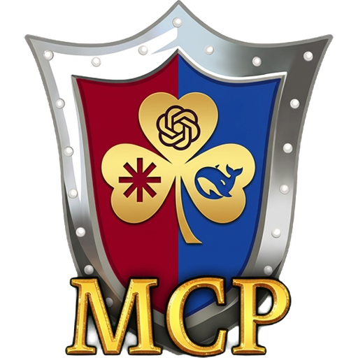

<div align="center">



# HotA MCP

**An MCP server that lets AI agents play Heroes of Might and Magic III: Horn of the Abyss like a human player — same screen, same buttons, a whole game from menu to victory.**

[](https://github.com/timoncool/hota-mcp/releases/latest)
[](https://github.com/timoncool/hota-mcp/releases)
[](LICENSE)
[](https://github.com/timoncool/hota-mcp/stargazers)
[](https://github.com/timoncool/hota-mcp/commits)

**[Website](https://timoncool.github.io/hota-mcp/en.html)** · **[Русский](README.md)** · **[English](README_EN.md)**


</div>

HotA MCP connects an AI agent (Claude, DeepSeek, or any MCP client) to **your own installed** Heroes III Complete + HotA + HD Mod on Windows. The agent reads the game as structured data — no OCR, no screenshots — and presses the real buttons of the real interface through window events. Install with one setup file, start with one shortcut, and say *"let's play Heroes"*.

Why: Heroes III is a long-horizon strategy game — economy, scouting, fights, a map that takes weeks to take. You cannot win it with one lucky move, so it makes an honest **benchmark of an agent's strategic thinking**, alone, against a human, or in a team with one.

> **Looking for testers and translators.** Version 1.0 is verified on the Russian edition of HotA. If you play Heroes III in another language, or want the agent's reference and messages in your language, see [Help wanted](#help-wanted).


## Features

- **Plays like a person** — reads what is on screen and clicks the game's own buttons; no mouse takeover, no computer-use, no internal game commands.
- **The whole game** — main menu, scenario and random-map setup, hotseat, save and load, adventure map, towns, recruiting, exchange, battles and sieges, level-ups, the end-of-game score.
- **Everything in words** — each `observe` opens with a brief of the turn; heroes, towns, stacks and objects by name; the game's own routes, costs and «visited» marks.
- **Honest limits** — refuses what a player cannot do (hidden map, an opponent's turn, a stale view) with a coded reason instead of guessing.
- **Built-in game reference** — rules, formulas, creature and artefact cards from the installed game's own tables, searchable offline (`hota_docs`, `hota_reference`).
- **Hotseat and teams** — the bridge gives the colour to move and the scenario's participants, the agent decides its own colour; allies and enemies come from the scenario, an ally's moves are logged.
- **Cost of a game** — dollars, tokens and calls per side and game day from Claude Code telemetry (`HotaMcp.exe --usage`).
- **Nothing to tweak** — per-user installer, no admin rights, no .NET to install, nothing written to the game folder or Windows autostart.

## Requirements

- Windows 10/11 x64.
- Your own **Heroes of Might and Magic III Complete** (GOG) with **Horn of the Abyss 1.8.1** and **HD Mod** — on attach the bridge checks that everything it relies on is in place in this build.
- An MCP client: Claude Code, Claude Desktop, Codex, or anything that speaks MCP over stdio or HTTP.

## Quick Start

1. **Install** — download [`HotaMcp-Setup-1.0.1.exe`](https://github.com/timoncool/hota-mcp/releases/latest) and run it (close the HD Launcher first). It finds the game by itself and puts a **«HotA MCP»** shortcut on the desktop.

2. **Connect your MCP client** — for Claude Code:
   ```bash
   claude mcp add hota -- "C:\Users\<you>\AppData\Local\Programs\HotaMcp\app\HotaMcp.exe" --stdio
   ```
   Claude Desktop (`claude_desktop_config.json`):
   ```json
   {
     "mcpServers": {
       "hota": {
         "command": "C:\\Users\\<you>\\AppData\\Local\\Programs\\HotaMcp\\app\\HotaMcp.exe",
         "args": ["--stdio"]
       }
     }
   }
   ```
   Use your install folder if you changed it.

3. **Play** — tell the agent *"let's play Heroes"*. It calls `start_game`: the service, your HD Launcher with the MCP tab and the game come up; or start everything yourself with the «HotA MCP» shortcut.

The server hands its rules to the client on connect (one action per call, no mouse, reference instead of memory). The agent's full playbook is the skill [`skills/hota-player/SKILL.md`](skills/hota-player/SKILL.md) — give it to your agent.

## Usage

| Tool | What it is for |
|---|---|
| `observe` | The whole state of your side and the actions legal on this screen — the one call you cannot skip |
| `act` | Any semantic action from `observe`: town, recruit, battle, dialog, end of turn |
| `nearby_targets`, `inspect_target`, `read_map` | What is around, the game's own route and cost, the explored map |
| `move_to`, `move_to_tile`, `attack_target` | Walking and fighting, kept apart on purpose |
| `inspect_cell`, `inspect_element`, `inspect_tile` | The right-click cards and the status line a player reads |
| `wait_for_turn`, `ally_log` | Hotseat: wait for your turn or for a window addressed to you; what your ally did |
| `plan`, `mark`, `read_journal` | The agent's own memory between turns |
| `hota_docs`, `hota_reference` | The game reference |
| `debug_snapshot` | A frame and the observation together, for reporting what the bridge reads wrong |

Every action takes an `operationId` and the `revision` of the observation it was decided on: a repeat with the same id is safe, a stale view is refused. `hota_tools` lists all 31 tools; [docs/knowledge/agent/01-tools.md](docs/knowledge/agent/01-tools.md) has their full descriptions.

## Configuration

There are no sides to configure and no settings files — everything comes from the game itself.

- **The agent decides its own colour** — when the game is created or loaded, from the scenario window that shows every side, who is human, the names and the teams. It writes the colour in its plan.
- **Every `observe` gives the interface colour** — "Ходит синий". The agent does not play another colour and waits with `wait_for_turn` and its own colour.
- **Nothing is bound.** Say "play for me" and the agent takes your colour until you are back.
- **On a computer's turn** the bridge shows the human a window on screen is addressed to: a fight against them, its result, spoils, a level-up, the end of the game.
- **Allies and opponents come from the scenario's teams:** an ally's moves are logged in `ally_log`, an opponent's are not.

**Cost of a game.** Add to `~/.claude/settings.json` (from the next session):
```json
"env": {
  "CLAUDE_CODE_ENABLE_TELEMETRY": "1",
  "OTEL_LOGS_EXPORTER": "otlp",
  "OTEL_EXPORTER_OTLP_LOGS_PROTOCOL": "http/json",
  "OTEL_EXPORTER_OTLP_LOGS_ENDPOINT": "http://127.0.0.1:18773/v1/logs",
  "OTEL_LOG_TOOL_DETAILS": "1"
}
```
Then `HotaMcp.exe --usage`. The data goes nowhere but the local bridge.

**Tool timeouts.** An autobattle can take up to 3 minutes and the bridge waits for its result: raise your client's tool timeout (Codex: `tool_timeout_sec = 200` under `[mcp_servers.hota]`, default 60).

## Help wanted

The bridge reads the game in the language it is installed in, and it is verified on the **Russian** edition of HotA 1.8.1. Its own briefs, the agent skill and the game reference are in Russian too. That is where you can help:

- **Play and report.** Install, let an agent play, and open an issue with what went wrong — [`CONTRIBUTING.md`](CONTRIBUTING.md) lists what to attach (a `debug_snapshot`, the journal, `errors.log`).
- **Other game languages.** If your HotA is English, Polish, German, Chinese… tell us what the bridge fails to read. About two dozen game phrases are matched by text; the list is in [`CONTRIBUTING.md`](CONTRIBUTING.md).
- **Translations.** The agent skill, the game reference (`docs/knowledge`), the README — into your language. Models play better when the reference speaks the language of the game they see.

## Documentation

- [CHANGELOG.md](CHANGELOG.md) — what is in each release
- [skills/hota-player/SKILL.md](skills/hota-player/SKILL.md) — how the agent plays
- [docs/knowledge/](docs/knowledge/) — the game reference served by the bridge
- [docs/DEVELOPING.md](docs/DEVELOPING.md) — how to map new screens and extend the bridge (in Russian)

Build from source: `native\launcher\build.cmd` (Visual Studio Build Tools, x86), then `tools\install.ps1` for a development install or `tools\build-installer.ps1` for the installer (NSIS 3).

## Other Projects by [@timoncool](https://github.com/timoncool)

| Project | Description |
|---------|-------------|
| [telegram-api-mcp](https://github.com/timoncool/telegram-api-mcp) | Full Telegram Bot API as MCP server |
| [civitai-mcp-ultimate](https://github.com/timoncool/civitai-mcp-ultimate) | Civitai API as MCP server |
| [trail-spec](https://github.com/timoncool/trail-spec) | TRAIL — cross-MCP content tracking protocol |
| [ACE-Step Studio](https://github.com/timoncool/ACE-Step-Studio) | AI music studio — songs, vocals, covers, videos |
| [VideoSOS](https://github.com/timoncool/videosos) | AI video production in the browser |
| [Bulka](https://github.com/timoncool/Bulka) | Live-coding music platform |

## Authors

- **Nerual Dreming** — [Telegram](https://t.me/nerual_dreming) | [neuro-cartel.com](https://neuro-cartel.com) | [ArtGeneration.me](https://artgeneration.me)

Heroes of Might and Magic III and Horn of the Abyss belong to their owners. This is an independent fan research project; no game files are included — the bridge works with your own legal copy.

## Support the Author

I build open-source software and do AI research. Most of what I create is free and available to everyone. Your donations help me keep creating without worrying about where the next meal comes from =)

**[All donation methods](https://github.com/timoncool/ACE-Step-Studio/blob/master/DONATE.md)** | **[dalink.to/nerual_dreming](https://dalink.to/nerual_dreming)** | **[boosty.to/neuro_art](https://boosty.to/neuro_art)**

- **BTC:** `1E7dHL22RpyhJGVpcvKdbyZgksSYkYeEBC`
- **ETH (ERC20):** `0xb5db65adf478983186d4897ba92fe2c25c594a0c`
- **USDT (TRC20):** `TQST9Lp2TjK6FiVkn4fwfGUee7NmkxEE7C`

## Star History

<a href="https://github.com/timoncool/hota-mcp/stargazers">
 <picture>
   <source media="(prefers-color-scheme: dark)" srcset="docs/stars-dark.svg" />
   <source media="(prefers-color-scheme: light)" srcset="docs/stars-light.svg" />
   
 </picture>
</a>

## License

[MIT](LICENSE)
